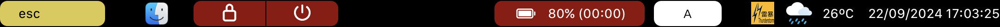

# MyTouchBar

Customising the Touch Bar on the Apple MacBook Pro.

This is mostly for my personal use.

## Features
- The control strip (the part on the right where you can control volume and brightness) is hidden to allow for customisation of the entire Touch Bar.
- Multitouch gestures are supported:
    - Swipe with one fingers to switch spaces (like pressing ctrl-left or right arrow);
    - Swipe with two fingers to control audio volume; and
    - Swipe with three fingers to control display brightness.
- Left-aligned items:
    - Escape key button
    - Active app icon
    - Lock screen button
    - Shutdown button
- Right-aligned items:
    - Mute and video buttons during video conferencing in Zoom
    - Battery level and time until empty/full
    - Input method button
    - Weather information obtained from the [Hong Kong Observatory (HKO)](https://www.hko.gov.hk/)
    - Current date and time
- Haptic feedback is provided when buttons are tapped.
- Extra feature: notifications are displayed when the HKO issues or cancels weather warnings.

## Technical details
This project involves various interactions with low-level or private APIs on MacOS.
`MyTouchBar/Utilities/` together with bridging headers in `MyTouchBar/CBridge/` contain logic for
- acquiring battery information;
- controlling display brightness;
- controlling system volume; and
- changing input methods.

Some functionalities, such as shutting down and interacting with Zoom, take advantage of AppleScript scripting.

`MyTouchBar/Utilities/HKO.swift` is an incomplete Swift interface for the [HKO Open Data API](https://www.hko.gov.hk/en/weatherAPI/doc/files/HKO_Open_Data_API_Documentation.pdf).

This project is inspired by [MTMR](https://github.com/Toxblh/MTMR), and some code is adopted from there.

Weather warning icons are from the HKO.
I forgot where I obtained the weather icons.
Please contact me for any copyright issues.
